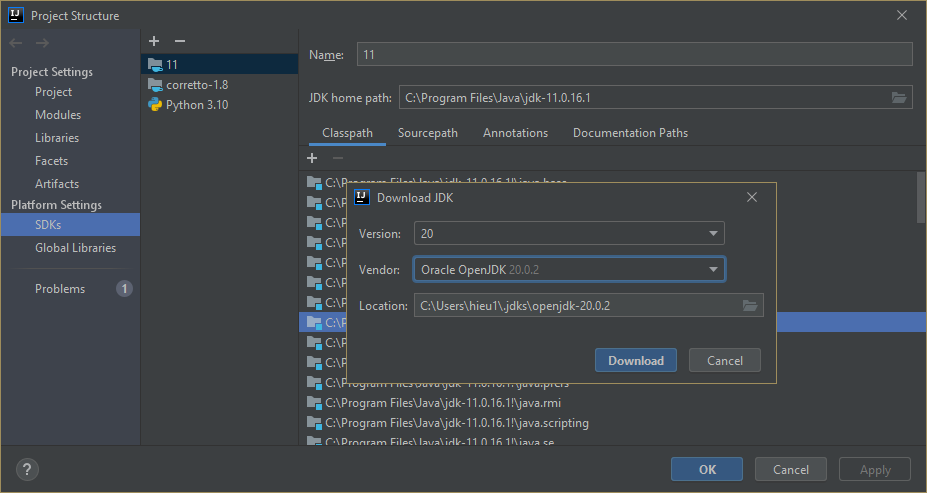
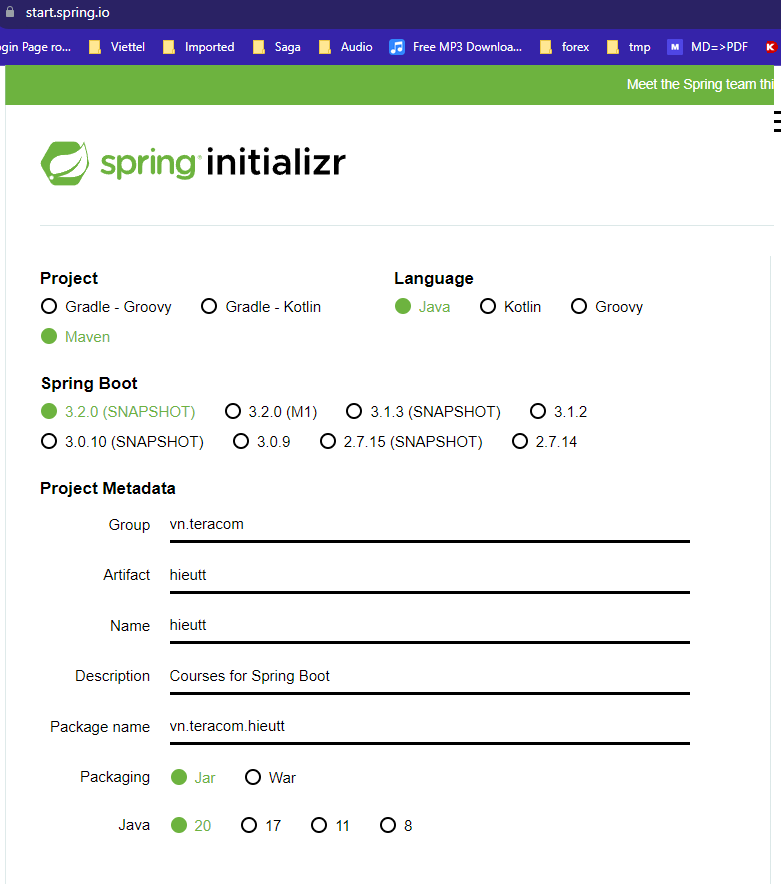
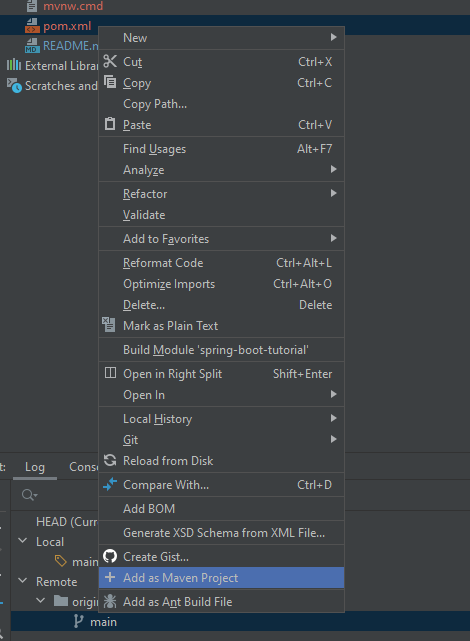

# spring-boot-tutorial
ReZero Spring Boot Course free to learn

## 0. Course Zero - Before and begin
### 1. Introduction
- I will guide you with this main document: README.md
- Need to learn first: 
    + Markdown readme docs language: https://www.markdownguide.org/basic-syntax/
    + Java language: https://www.javatpoint.com/java-tutorial
    + Java and OOP: https://www.javatpoint.com/java-oops-concepts
- Some optional must know:
  + Restful API
  + Database, SQL language, RDMS(relational database management system)
  + Oauth2 definition
  + What is Spring Framework - and their history
  + git - version source control tool
  + How to use IntelliJ Idea
- PlantUml syntax (optional) for draw diagram in MarkDown(md) file:
  - home page: https://www.plantuml.com/
  - enable it in IntelliJ Idea: File | Settings | Languages & Frameworks | Markdown | PlantUml
- Course will be mark with Tag of Git, please follow it. For ex: Tag course_0_introduction

### 2. Prepare to install tools
- JDK 20
- IntelliJ Idea or Eclipse Java or NetBean for Java develop tool
- Maven mvn installed

### 3. Checking environment
- Maven is the dependency management tool for Java like npm in java-script
- in Windows, maven cached dependency jars file in user's home dir: `%userprofile%\.m2\repository\`
- in Linux & MacOs, maven cached dependency jars file in user's home dir: `~/.m2/repository/`
- You can download jdk20 in Ida tool like this:
  
  
  - after installed, go to ProjectStructure menu > Project SDK > choose Jdk 20
  - add to `PATH` environment variable that folder(google Windows or Linux Path variable): `C:\Users\hieu1\.jdks\openjdk-20.0.2\bin`
  - add Environment for java home(google): JAVA_HOME=`C:\Users\hieu1\.jdks\openjdk-20.0.2`

We can check environment by some command:
> java --version
```log
openjdk 20.0.2 2023-07-18
OpenJDK Runtime Environment (build 20.0.2+9-78)
OpenJDK 64-Bit Server VM (build 20.0.2+9-78, mixed mode, sharing)
```
> mvn --version
```log
Apache Maven 3.8.6 (84538c9988a25aec085021c365c560670ad80f63)
Maven home: F:\Documents\apache-maven-3.8.6
Java version: 11.0.16.1, vendor: Oracle Corporation, runtime: C:\Program Files\Java\jdk-11.0.16.1
Default locale: en_US, platform encoding: Cp1252
OS name: "windows 10", version: "10.0", arch: "amd64", family: "windows"
```

## 0. Course Zero - Before and begin
### 1. Introduction
- Basic spring boot:
  - API
  - Service
  - Repository query to Database
  - What is Spring, What is Bean?
  - Practice with your friends

### 2. Create Spring project
1. Go to `https://start.spring.io/`
2. Choose the latest Spring generation like below:

  

3. Unzip file downloaded, copy `src` directory in to THIS Project
4. Choose pom.xml > right click > import project as Maven project

  
5. Open pom.xml > right click > reload project: waiting for Maven download all dependencies of this project
6. Open DemoApplication.java, click &#9654; for run Project
7. See the result:

```log
C:\Users\hieu1\.jdks\openjdk-20.0.2\bin\java.exe -XX:TieredStopAtLevel=1 -noverify -Dspring.output.ansi.enabled=always "-javaagent:C:\Program Files\JetBrains\IntelliJ IDEA 2021.1.2\lib\idea_rt.jar=52967:C:\Program Files\JetBrains\IntelliJ IDEA 2021.1.2\bin" -Dcom.sun.management.jmxremote -Dspring.jmx.enabled=true -Dspring.liveBeansView.mbeanDomain -Dspring.application.admin.enabled=true -Dfile.encoding=UTF-8 -classpath F:\Documents\workspace\spring-boot-tutorial\target\classes;C:\Users\hieu1\.m2\repository\org\springframework\boot\spring-boot-starter\3.2.0-SNAPSHOT\spring-boot-starter-3.2.0-20230810.151153-208.jar;C:\Users\hieu1\.m2\repository\org\springframework\boot\spring-boot\3.2.0-SNAPSHOT\spring-boot-3.2.0-20230810.151153-208.jar;C:\Users\hieu1\.m2\repository\org\springframework\spring-context\6.1.0-SNAPSHOT\spring-context-6.1.0-20230811.151134-423.jar;C:\Users\hieu1\.m2\repository\org\springframework\spring-aop\6.1.0-SNAPSHOT\spring-aop-6.1.0-20230811.151134-423.jar;C:\Users\hieu1\.m2\repository\org\springframework\spring-beans\6.1.0-SNAPSHOT\spring-beans-6.1.0-20230811.151134-423.jar;C:\Users\hieu1\.m2\repository\org\springframework\spring-expression\6.1.0-SNAPSHOT\spring-expression-6.1.0-20230811.151134-423.jar;C:\Users\hieu1\.m2\repository\io\micrometer\micrometer-observation\1.12.0-SNAPSHOT\micrometer-observation-1.12.0-20230810.232943-58.jar;C:\Users\hieu1\.m2\repository\io\micrometer\micrometer-commons\1.12.0-SNAPSHOT\micrometer-commons-1.12.0-20230810.232943-58.jar;C:\Users\hieu1\.m2\repository\org\springframework\boot\spring-boot-autoconfigure\3.2.0-SNAPSHOT\spring-boot-autoconfigure-3.2.0-20230810.151153-209.jar;C:\Users\hieu1\.m2\repository\org\springframework\boot\spring-boot-starter-logging\3.2.0-SNAPSHOT\spring-boot-starter-logging-3.2.0-20230810.151153-208.jar;C:\Users\hieu1\.m2\repository\ch\qos\logback\logback-classic\1.4.11\logback-classic-1.4.11.jar;C:\Users\hieu1\.m2\repository\ch\qos\logback\logback-core\1.4.11\logback-core-1.4.11.jar;C:\Users\hieu1\.m2\repository\org\apache\logging\log4j\log4j-to-slf4j\2.20.0\log4j-to-slf4j-2.20.0.jar;C:\Users\hieu1\.m2\repository\org\apache\logging\log4j\log4j-api\2.20.0\log4j-api-2.20.0.jar;C:\Users\hieu1\.m2\repository\org\slf4j\jul-to-slf4j\2.0.7\jul-to-slf4j-2.0.7.jar;C:\Users\hieu1\.m2\repository\jakarta\annotation\jakarta.annotation-api\2.1.1\jakarta.annotation-api-2.1.1.jar;C:\Users\hieu1\.m2\repository\org\springframework\spring-core\6.1.0-SNAPSHOT\spring-core-6.1.0-20230811.151134-423.jar;C:\Users\hieu1\.m2\repository\org\springframework\spring-jcl\6.1.0-SNAPSHOT\spring-jcl-6.1.0-20230811.151134-423.jar;C:\Users\hieu1\.m2\repository\org\yaml\snakeyaml\2.1\snakeyaml-2.1.jar;C:\Users\hieu1\.m2\repository\org\slf4j\slf4j-api\2.0.7\slf4j-api-2.0.7.jar com.example.demo.DemoApplication
OpenJDK 64-Bit Server VM warning: Options -Xverify:none and -noverify were deprecated in JDK 13 and will likely be removed in a future release.

  .   ____          _            __ _ _
 /\\ / ___'_ __ _ _(_)_ __  __ _ \ \ \ \
( ( )\___ | '_ | '_| | '_ \/ _` | \ \ \ \
 \\/  ___)| |_)| | | | | || (_| |  ) ) ) )
  '  |____| .__|_| |_|_| |_\__, | / / / /
 =========|_|==============|___/=/_/_/_/
 :: Spring Boot ::       (v3.2.0-SNAPSHOT)

2023-08-12T11:23:05.225+07:00  INFO 19224 --- [           main] com.example.demo.DemoApplication         : Starting DemoApplication using Java 20.0.2 with PID 19224 (F:\Documents\workspace\spring-boot-tutorial\target\classes started by hieu1 in F:\Documents\workspace\spring-boot-tutorial)
2023-08-12T11:23:05.227+07:00  INFO 19224 --- [           main] com.example.demo.DemoApplication         : No active profile set, falling back to 1 default profile: "default"
2023-08-12T11:23:05.456+07:00  INFO 19224 --- [           main] com.example.demo.DemoApplication         : Started DemoApplication in 0.388 seconds (process running for 0.8)

Process finished with exit code 0
```